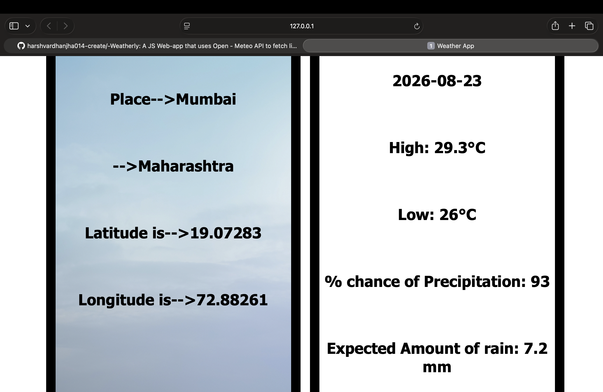

# 🌦️ Weather App

A weather dashboard built with HTML, CSS, and Vanilla JavaScript, using the Open-Meteo Geocoding API and Open-Meteo Weather API to retrieve location-based weather information.

The user enters a place, the application finds its geographical coordinates, and those coordinates are then used to fetch the corresponding weather forecast.

## 🚀 Features

- 🔎 Search for a location by name
- 📍 Retrieve latitude and longitude through geocoding
- 🌡️ Display daily maximum temperature
- ❄️ Display daily minimum temperature
- 🌧️ Display mean precipitation probability
- 💧 Display expected precipitation amount
- 📅 Display the forecast date
- 🌍 Automatically use the selected location's timezone
- 📡 Fetch weather data dynamically using JavaScript
- 🎨 Custom CSS interface with background imagery

## 🛠️ Technologies Used

- HTML5 — Structure
- CSS3 — Styling and layout
- JavaScript — Application logic and API handling
- Open-Meteo Geocoding API — Location search
- Open-Meteo Weather API — Weather data

## 🔄 How It Works

The application uses a two-step API process:

User enters a place
        ↓
Open-Meteo Geocoding API
        ↓
Location → Latitude + Longitude
        ↓
Open-Meteo Weather API
        ↓
Weather data for those coordinates
        ↓
Data displayed in the UI

### 1. Location Search

The entered place is sent to the Open-Meteo Geocoding API.

The application retrieves:

- Place name
- State / administrative region
- Latitude
- Longitude

### 2. Weather Request

The latitude and longitude obtained from the geocoding API are then passed into the Open-Meteo Forecast API.

The application requests daily weather data including:

- Maximum temperature
- Minimum temperature
- Mean precipitation probability
- Maximum precipitation probability
- Total precipitation
- Weather code
- Maximum wind speed
- Sunrise
- Sunset

## 📊 Weather Information Displayed

| Data | Description |
|---|---|
| 📍 Place | Selected location |
| 🗺️ State | Administrative region |
| 🌐 Latitude | Geographic latitude |
| 🌐 Longitude | Geographic longitude |
| 📅 Date | Forecast date |
| 🌡️ High | Maximum temperature |
| ❄️ Low | Minimum temperature |
| 🌧️ Rain Chance | Mean precipitation probability |
| 💧 Rain Amount | Expected precipitation in mm |

## 📁 Project Structure

Weather-App/
│
├── index.html
├── index.js
├── style.css
├── clear_backgound.png
└── README.md

## ▶️ Running the Project

No backend or package installation is required.

1. Clone the repository.

2. Open the project folder in VS Code.

3. Open index.html in your browser.

4. For development, you can use the Live Server extension in VS Code.

5. Enter a location such as Bengaluru or Mumbai and click Search.

## 🧠 What I Learned

This project was built while learning JavaScript and working with APIs.

Through this project, I practiced:

- DOM manipulation
- Button event handling
- Reading user input
- Using fetch()
- Working with Promises
- Converting API responses to JSON
- Accessing nested JavaScript objects
- Working with arrays returned by APIs
- Creating dynamic API URLs
- Chaining API requests
- Passing data from one API request into another
- Dynamically updating HTML elements
- Building layouts using CSS

One of the most important concepts I learned was how the output of one API request can become the input of another API request.

## 🔮 Future Improvements

- [ ] Add loading indicators
- [ ] Add proper error handling
- [ ] Handle invalid or unknown locations
- [ ] Display weather conditions using weather codes
- [ ] Add weather icons
- [ ] Display wind speed
- [ ] Display sunrise and sunset
- [ ] Add a multi-day forecast
- [ ] Improve mobile responsiveness
- [ ] Add dynamic backgrounds based on weather conditions
- [ ] Improve overall UI/UX
- [ ] Add keyboard support for searching
- [ ] Refactor API logic using async/await

## ⚠️ Current Limitations

This is an early version of the project and was primarily built to practice JavaScript, DOM manipulation, API requests, and asynchronous programming.

The current version does not yet include comprehensive error handling, advanced responsive design, weather icons, or a complete multi-day forecast interface.

These features are planned for future iterations.

## 📸 Project Preview

## 🌐 APIs Used

### Open-Meteo Geocoding API

Used to convert a location name into geographical coordinates.

https://geocoding-api.open-meteo.com/

### Open-Meteo Weather API

Used to retrieve weather forecast data for the selected coordinates.

https://api.open-meteo.com/

## 👨‍💻 Author

Harshvardhan Jha

Built as part of my journey learning JavaScript, APIs, browser development, and project-based programming.

## ⭐ Acknowledgements

Weather data provided by Open-Meteo.

If you find the project interesting, feel free to ⭐ the repository!
